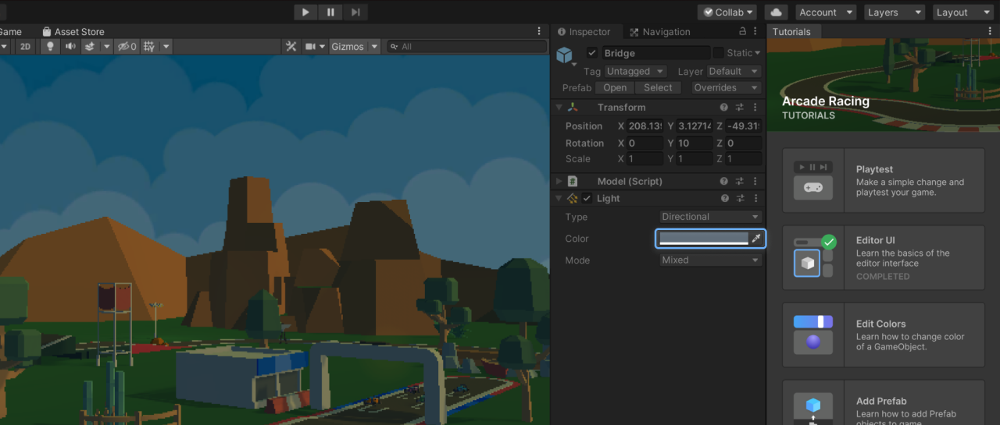

# About Tutorial Framework

This package is used to display interactive in-Editor tutorials (IET) in tutorial projects and project templates.

## Preview package
This package is available as a preview package. It is not recommended for use in production. The features and documentation of this package are subject to major changes until its official release.

## Installation

This package is not currently discoverable. To install this package, add the following line to the `dependencies` list of `Packages/manifest.json`:  
`"com.unity.learn.iet-framework": "2.0.0-pre.5"`

Make sure to update to the latest version of the package.

## Requirements

This version of Tutorial Framework is compatible with the following versions of the Unity Editor:

* 2019.4 and newer (LTS versions recommended)

## Known issues
- Masking and highlighting settings don't support UI Toolkit (formerly known as UIElements). This feature is planned for the 2.1 release.
- A benign "BuildStartedCriterion must be instantiated using the ScriptableObject.CreateInstance method..." warning in the Console when making a build.
- `TutorialWelcomePage.WindowTitle` cannot be edited at real-time; reopen the `TutorialWelcomePage` in order to see the changes.
- Windows & Unity 2019.4 (and older): A benign "No texture data available to upload" error in the Console when switching target platform while having a tutorial page with video open.
- The save dialog does not appear if Play Mode is active when exiting the tutorial.
- `SceneViewCameraMovedCriterion` has no ability to distinguish different types of camera movements.
- "A Native Collection has not been disposed..." error might appear in the Console on Unity 2021.
- Certain editor windows were moved from `UnityEngine` assembly to `UnityEngine.CoreModules` in Unity 2020 which might cause a (silent) misconfiguration of masking settings to occur
if upgrading a tutorial project from Unity 2019 to Unity 2020. Look for **Editor Window Type** fields with **None** as the value to spot these misconfigurations.

# Using Tutorial Framework

To actually develop any tutorials, the Tutorial Authoring Tools package is needed. Install it by adding the following line to `Packages/manifest.json`:  
`"com.unity.learn.iet-framework.authoring": "1.0.0-pre.5"`  
Make sure to update to the latest version of the package. After the installation, refer to the Tutorial Authoring Tools' documentation for more information.
