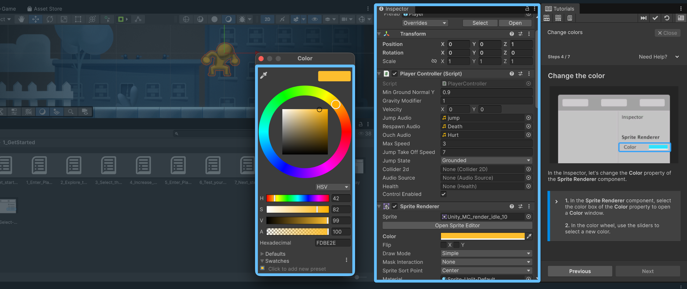

# About Tutorial Framework

The Tutorial Framework package is used to display interactive in-Editor tutorials (IETs) inside Unity projects.

This package is required for IETs to be experienced as a user.

> [!NOTE]
> If you are looking to create and edit tutorials, you need to install the [Tutorial Authoring Tools] package in addition to this one.

## Installation

1. From the main menu of the Unity Editor, select **Window** > **Package Management** > **Package Manager**. 
2. From the [navigation panel](https://docs.unity3d.com/Manual/upm-ui-nav.html), select **Unity Registry**. 
3. Search for “Tutorial Framework”, then click **Install**.

## Requirements

This version of Tutorial Framework is compatible with the following versions of the Unity Editor:

* Unity 6.5 and newer

[Tutorial Authoring Tools]: https://docs.unity3d.com/Packages/com.unity.learn.iet-framework.authoring@2.0