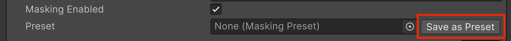
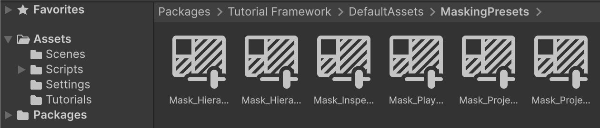
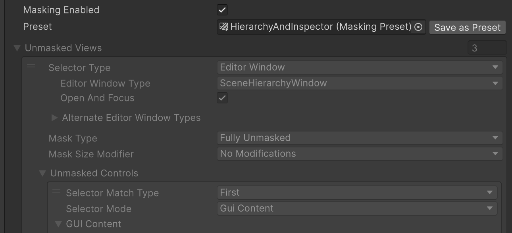
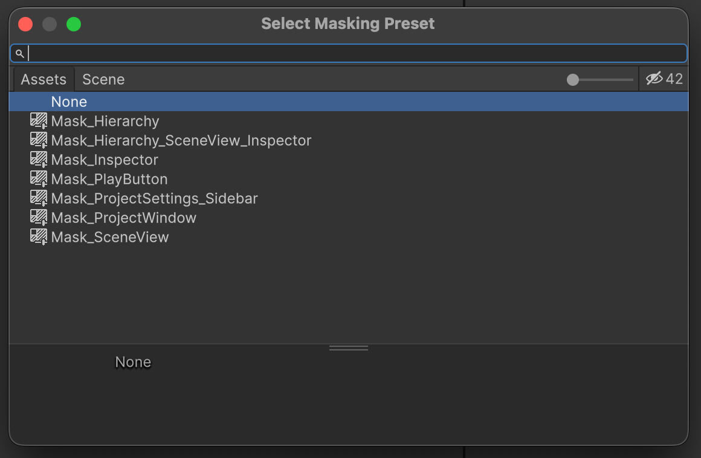
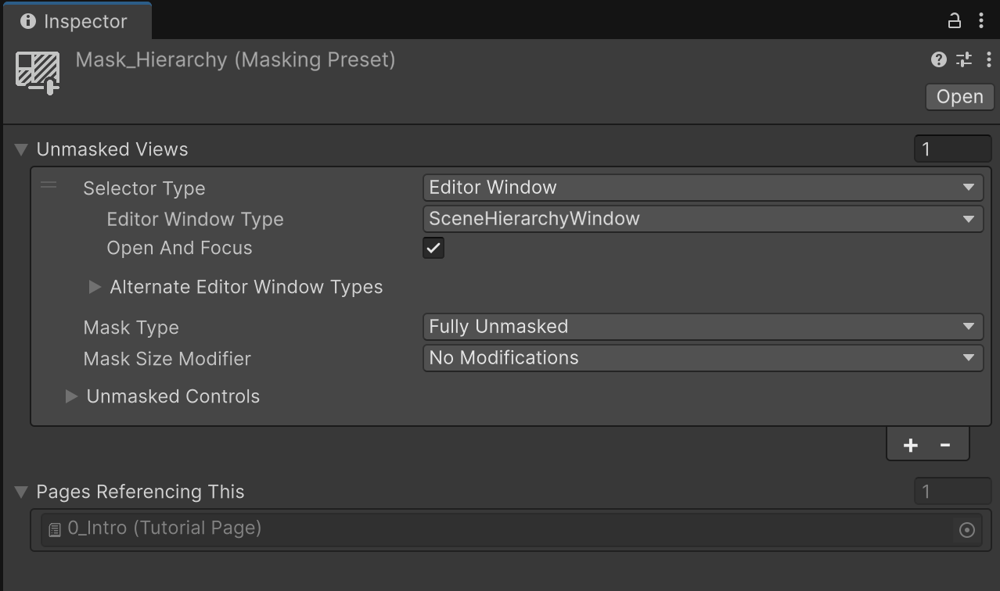

# Masking Presets

Masking Presets work in conjunction with the [Masking feature](https://docs.unity3d.com/Packages/com.unity.learn.iet-framework.authoring@2.0/manual/masking-highlighting.html) of IETs. They wrap Masking settings into presets that can be conveniently reused and shared wherever Masking is supported. This speeds up mask creation, and avoids trial and error and mistakes.

To create a Preset, either:

* Right-click in the **Project** view and select **Create** > **Tutorials** > **Masking Preset**.
* From any interface that supports Masking (such as a paragraph in a Tutorial Page), use the **Save as Preset** button shown next to the **Preset** field:

Once the MaskingPreset has been created, it will appear as an asset in the project:

## Working with Masking Presets

When a Masking Preset is referenced in a **Preset** field, the whole UI of the Masking Settings will be shown as disabled:

This indicates that a preset is in effect, and that to modify the mask the user needs to go and edit the preset itself.

To make the masking unique again and be able to edit the Masking options in place, you will have to remove the preset reference by selecting the **Preset** field and hitting the Delete/Backspace key.

## Sample Masking Presets

The Tutorial Framework package ships with a few Masking Presets that can be used right away, or as guidance on how to find/mask UI elements:

> [!NOTE]
> When browsing for these default presets, ensure you have checked the little **eye** button in the top-right corner of the **Object Browser** window, in order to see assets included in packages.

## Masking Preset Properties

| Property | Description |
| :---- | :---- |
| **Unmasked Views** | This struct contains the properties of the views that masking will leave visible. In other words, all views contained here will be visible and interactable, everything else will be masked. |
| **Pages Referencing This** | This list visualises the Tutorial Page assets that are currently referencing this Masking Preset. Useful to know if the preset can be safely deleted or not. This list is automatically populated, and is non-editable. |