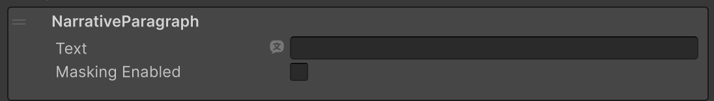
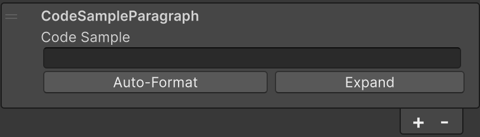
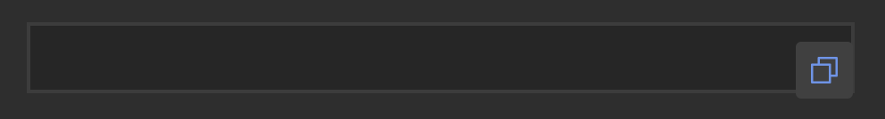
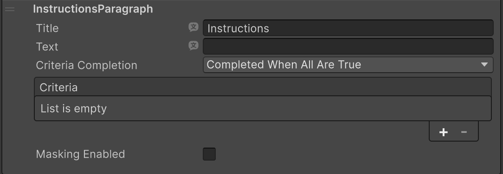
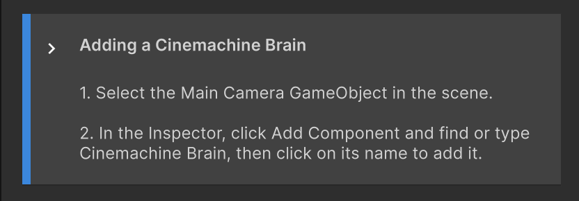
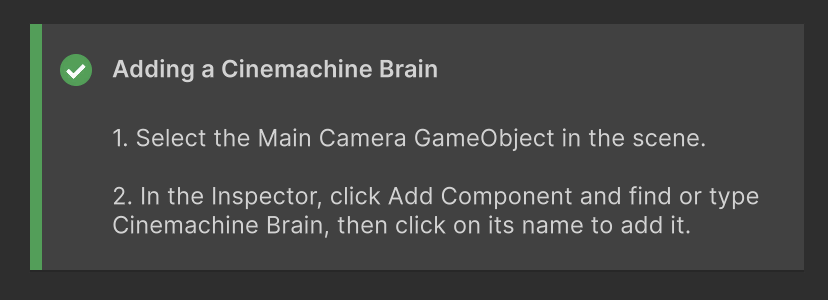
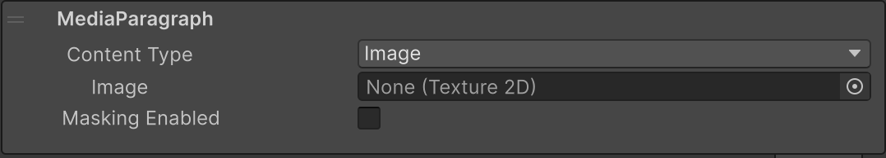
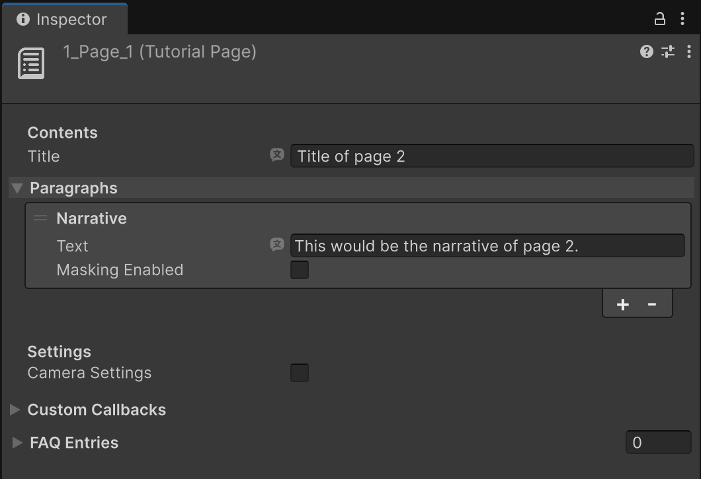

# Tutorial Pages

Tutorial Page assets contain the actual content of a Tutorial: the text, the instructions, images, videos, etc. Users engage with pages as they progress through the learning experience.

Pages are sub-assets of [Tutorials](tutorials.md), and as such, they can't be moved from Tutorial to Tutorial.

## Paragraphs
There are several paragraph types you can add to your **Tutorial Page** assets:

* [NarrativeParagraph](#narrative-paragraph)
* [InstructionsParagraph](#instructions-paragraph)
* [MediaParagraph](#media-paragraph)
* [CodeSampleParagraph](#code-sample-paragraph)

You can also add custom paragraph types by inheriting from the class `ParagraphBase`. This allows you to virtually include any kind of content inside IETs, that can be experienced directly within the **Tutorials** window.

You can mix and match them as you please, and add multiple paragraphs of the same type to a single Tutorial Page.

### Narrative paragraph
Narrative paragraphs simply display as a textbox in the Tutorial Page, and can be used to drive the explanations and directions that make up the Tutorial.

### Code Sample paragraph
Code Sample paragraphs are used to display code blocks. They're useful if you want to provide your users with ready-made code, since the box provides a button to copy the displayed code.

Use the **Auto-Format** button to remove unnecessary spaces from copied code.

Use the **Expand** button to expand the text box, for a better editing experience.

Hover your cursor over the Code Sample box in the **Tutorials** window reveals the **Copy Code Sample** button.

### Instructions paragraph
While Narrative paragraphs drive most of the text in a Tutorial, Instruction paragraphs provide the ability to display clear steps that the user should, or must, follow in order to complete the Tutorial.

Instructions paragraphs display as a box that contains the instruction lines. It's up to you to decide how to format them (i.e. the paragraph doesn't add the numbers or the spacing automatically).

#### Criterias

Instructions can also be tied to Criteria, which is a way to ensure that the user has completed the instructions shown before letting them move forward to the next Tutorial Page. Criteria can verify many conditions, and you can create custom Criteria in addition to using the ones provided in the package.

An Instruction Paragraph that has at least one Criterion defined will show as a box with a blue line to the left, indicating that it hasn't been complete and that it's awaiting user action:

When the instructions are carried out and the Criteria associated verify that that actually happened, the Instructions paragraph will display a green bar and a green checkmark, to reflect that:

If a Tutorial Page contains more than one Instructions paragraph and also uses Criteria, the Criteria will resolve following the order of the paragraphs they belong to. In other words, as the user completes the first block of instructions they will see that block turn green, then the second one, etc.

If any Criterion is defined, the button leading to the next Tutorial Page will be disabled until all of the Instruction blocks on the page are complete:

Once all Instructions blocks are completed, the button to advance to the next Tutorial Page will become available again.

### Media paragraph

**Media** paragraphs display images, video clips, and video URLs.

Open the **Content Type** dropdown and select your preferred media type.

For video clips and video URLs, use the **Loop** property to have the video play continuously and the **Auto Start** property to have the video start when the user opens the page.

## Tutorial Page Properties

| Type | Description |
| :---- | :---- |
| **FAQ Entries** | A list of frequently asked questions specific to this page. These are only visualized when the user is inside a Tutorial. |

#### Contents

| Type | Description |
| :---- | :---- |
| **Title** | The title of the page, shown in the card/header of the **Tutorials** window. |
| **Paragraphs** | The list of [paragraphs](#paragraphs) that make up the content of this page. Add and remove them using the list's +/- buttons. |

#### Settings

| Type | Description |
| :---- | :---- |
| **Camera Settings** | If enabled, Unity moves the Scene view camera to the specified position when this page is shown. |
| **Auto Advance** | If enabled, the page automatically advances to the next one once all its Criteria are satisfied, without requiring the user to click the **Next** button. |

#### Button Labels

| Type | Description |
| :---- | :---- |
| **Next Button** | The text shown on the **Next** button on all pages except the last one. Defaults to `Next`. |
| **Done Button** | The text shown on the **Next** button when this is the last page of the Tutorial. Defaults to `Done`. |

#### Sounds

| Type | Description |
| :---- | :---- |
| **Completed Sound** | An audio clip played when this page is marked as completed. |

#### Custom Callbacks

You can use these callbacks to trigger functionality when specific events happen on this page. Tutorial Page assets support:

| Type | Description |
| :---- | :---- |
| **Showing** | Raised before this page is displayed (even when going back). |
| **Shown** | Raised after this page is displayed (even when going back). |
| **Staying** | Raised while the user is staying on this page, every Editor frame. |
| **Criteria Validated** | Raised when this page's Criteria are tested for completion. |
| **Masking Settings Changed** | Raised when this page's masking settings are changed. |
| **Non Masking Settings Changed** | Raised when this page's non-masking settings are changed. |