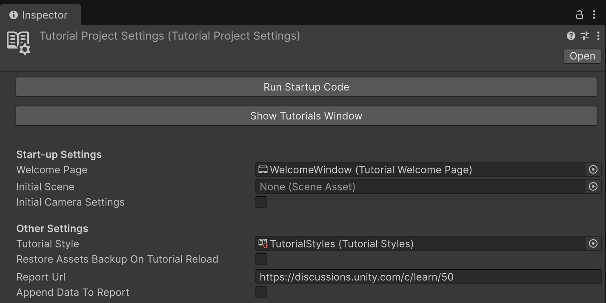

# Tutorial Project Settings

**Tutorial Project Settings** contains important settings that define how a Tutorial project behaves.

> [!NOTE]
> There should only be one Tutorial Project Settings object in each Unity project. Having multiple means that one of them will be ignored.

If you use a preset of a complete Tutorial project, a **Tutorial Project Settings** asset is automatically added to your project. Otherwise, follow these instructions to create your own **Tutorial Project Settings** asset:

1. In the **Project** window, right-click in a folder and select **Create** > **Tutorials** > **Tutorial Project Settings**.
2. In the **Inspector** window of the **Tutorial Project Settings** asset, review the properties described below.

## Tutorial Project Settings Properties

| Property | Description |
| :---- | :---- |
| **Run Startup Code** | This button displays the **Welcome** dialog (if any) and runs any startup code that's been defined on this asset, like using the **Initial Camera Settings** or loading the **Initial Scene**. |
| **Welcome Page** | Use the **Welcome Page** picker (**⊙**) to select a welcome page that displays when the user first opens the project. |
| **Initial Scene** | Use the **Initial Scene** picker (**⊙**) to select the scene you want to automatically open when the user first opens your tutorial. |
| **Initial Camera Settings** | Customize how your camera behaves in your initial scene. For more precision, you can alter your camera view in the **Scene** view to create the view you want, then select **Store Current Scene View Camera Settings** to use your camera's exact **Pivot** and **Rotation** values. |
| **Tutorial Style** | Use the **Tutorial Style** picker (**⊙**) to select any custom [Tutorial Style](tutorial-styles.md) you want your tutorials to use. The tutorial style you select affects Masking and Highlighting, and allows you to specify a Tutorial Style Sheet. |
| **Restore Assets Backup on Tutorial Reload** | If enabled, the original assets of a project are restored when the Editor is closed and then reopened. |
| **Report URL** | The address to visit when users select the **Report issue** button in a Tutorial. |
| **Append Data to Report** | If enabled, this will add a query string at the end of the URL that is generated when the **Report issue** button is selected. The query string has a single variable, `tutorialdata`, that contains a JSON object with three string properties: `ContainerTitle`, `TutorialTitle`, and `PageTitle`. These properties describe the titles of the page, tutorial, and Container the user is in when they report an issue. |
