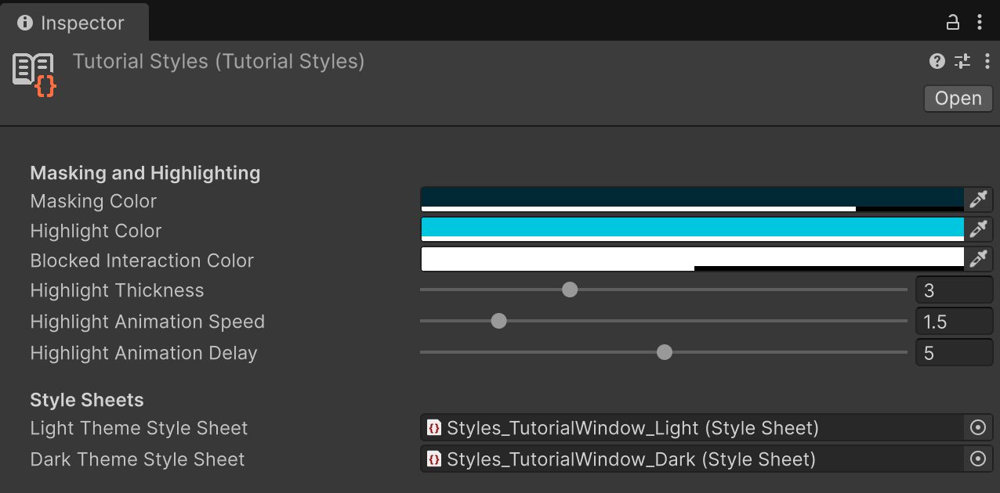

# Tutorial Styles

**Tutorial Styles** allow you to add an even greater amount of personalization to your tutorials.

You can use the **Tutorial Styles** asset to customize the appearance of [Masking](https://docs.unity3d.com/Packages/com.unity.learn.iet-framework.authoring@2.0/manual/masking-highlighting.html) and Highlighting.

## Tutorial Styles Properties

### Masking and Highlighting

| Property | Description |
| :---- | :---- |
| **Masking Color** | The color used to mask Editor areas. |
| **Highlight Color** | The color used to frame Editor elements in order to highlight them. |
| **Blocked Interactions** | The color used to show that a framed visible element (that is, unmasked) is not interactable. |
| **Highlight Thickness** | The thickness of the highlighting line. |
| **Highlight Animation Speed** | The speed at which the highlighting line animates. |
| **Highlight Animation Delay** | The amount of seconds to wait before starting the highlight animation. |

### Style Sheets

| Property | Description |
| :---- | :---- |
| **Style Sheets** | Assign custom USS Style Sheets to completely customize how the Tutorials window looks. |