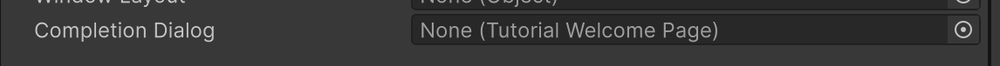
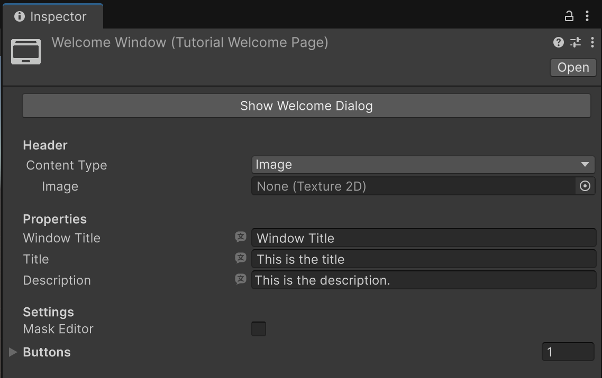

# Tutorial Welcome Page

The Tutorial Welcome Page asset is a welcome dialog that only appears to users the first time they open the project. It can be used to welcome users to the project and provide initial instructions.

## Add a Tutorial Welcome Page

To create and configure a Tutorial Welcome Page, follow these instructions:

1. In the **Project** window, right-click in a folder and select **Create** > **Tutorials** > **Tutorial Welcome Page**.
2. Find and select the [Tutorial Project Settings](tutorial-project-settings.md) asset. If you don't have one yet, right-click in a folder and select **Create** > **Tutorials** > **Tutorial Project Settings**.
3. Under the **Start-Up Settings** section, select the **Welcome Page** picker (**⊙**) and select the **Tutorial Welcome Page** asset.
4. Click the **Show Welcome Dialog** button to see a preview of the **Tutorial Welcome Page**.

## Buttons

You can add multiple buttons to the bottom of a Tutorial Welcome Page, in order to encourage the user to immediately take specific actions.

To add buttons:

1. In the **Inspector** window of the Tutorial Welcome Page, under **Buttons**, add as many as you need with the **+** button.
2. Expand the foldout (triangle) to visualise the button options, and add Title, Tooltip and on-click action as needed.
3. In the **On Click** section, select the **Editor and Runtime** option in the dropdown to ensure that the button works also in Edit mode.

## Show a popup on tutorial completion

As mentioned, a Tutorial Welcome Page can be shown when the project first opens. But you can also use them to serve a message or information between tutorials, by displaying a Tutorial Welcome Page window when the user completes a specific tutorial.

To do so, create a new Tutorial Welcome Page asset, and reference it inside a Tutorial asset, under **Completion Dialog**:

## Tutorial Welcome Page Properties

| Property | Description |
| :---- | :---- |
| **Show Welcome Dialog** | Click this to preview the Welcome dialog. |

### Header

| Property | Description |
| :---- | :---- |
| **Content Type** | Like Tutorial Page assets, Tutorial Welcome Page assets support a banner that can be either an image or a video. |

### Properties

| Property | Description |
| :---- | :---- |
| **Window Title** | The name of the Welcome dialog. |
| **Title** | The title to use in the Welcome dialog. |
| **Description** | A description to use in the Welcome dialog. |

### Settings

| Property | Description |
| :---- | :---- |
| **Mask Editor** | Enable to apply masking to the rest of the Editor when the Tutorial Welcome Page displays. |
| **Buttons** | Use the foldouts (triangles) to expand the **Buttons** > **Elements** sections. Use the **Add to the list** (**+**) and **Remove selection from the list** (**-**) buttons to add and remove buttons. |
| **Text** | The text of the button. |
| **Tooltip** | The text displayed in the tooltip when users hover their cursor over the button. |