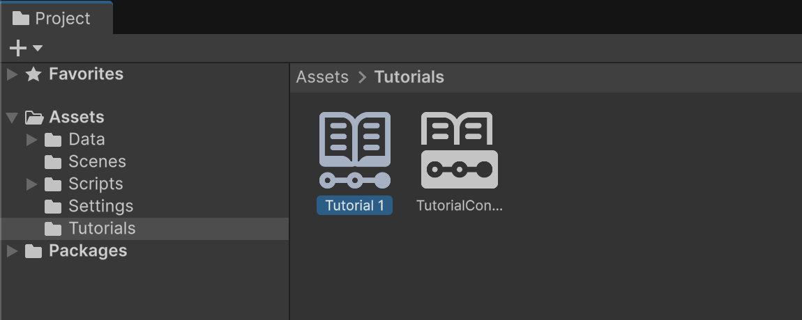
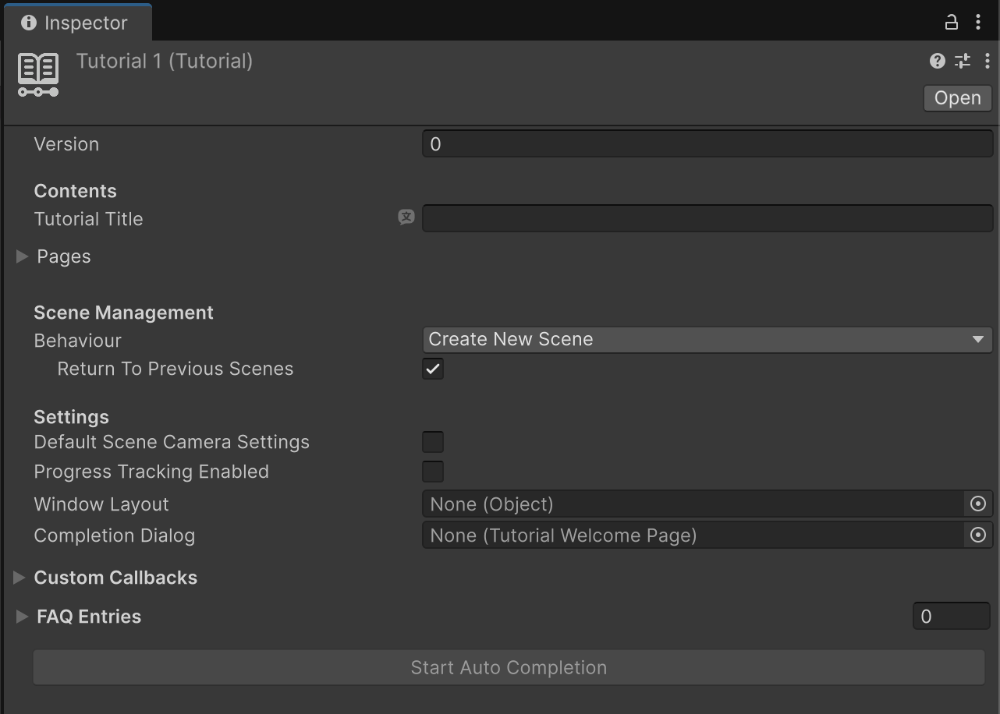
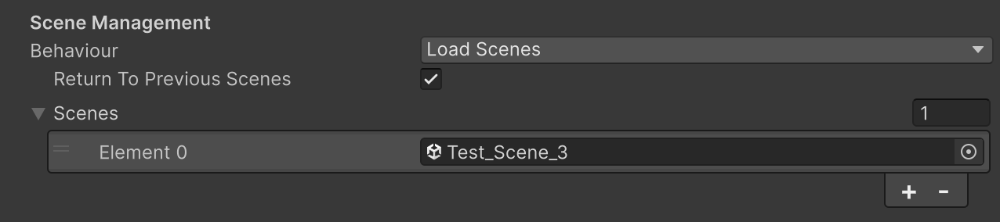

# Tutorials

Tutorial assets are the building blocks of your learning experiences, and are referenced by [Tutorial Containers](tutorial-containers.md). They help users track their progress, as they clearly display progression with a green badge – reminding the user where they left off.

Tutorials appear in the **Tutorials** window as buttons, like Containers, and give your users information about what each tutorial is about. Use Tutorial assets in conjunction with Tutorial Container assets to enable your users to access the information you want to give them in the order you want them to have it.

## Creating a new Tutorial

To create and configure a Tutorial asset:

1. In the **Project** view, right-click and select **Create** > **Tutorials** > **Tutorial**.

## Displaying a Tutorial

In order to make use of a Tutorial, you need to reference it in a [Tutorial Container](tutorial-containers.md).

1. In the **Tutorials** folder, select a Tutorial Container asset.
2. In the **Inspector** window, use the foldout (triangle) to expand the **Sections** section.
3. Click the **+** button to add a section to the Container. Ensure that the section's **Type** is set to **Tutorial**, then reference the Tutorial you want to display.

This adds the Tutorial to the Container's "table of contents", when viewed in the **Tutorials** window.

> [!TIP]
> Tutorials that are not referenced by any Tutorial Container won't be displayed, and are effectively invisible to the user.

## Tutorial Properties

| Property | Description |
| :---- | :---- |
| **Version** | The version of the Tutorial. Bumping up the version will make sure that once a user downloads a new version of the project containing the Tutorial, their progress will be reset. |

#### Contents

| Property | Description |
| :---- | :---- |
| **Tutorial Title** | The title of the Tutorial, as shown on the button in the Tutorials window. |
| **Pages** | The Tutorial Pages that make up this Tutorial. Add and remove them using the list's +/- buttons. You can also reorder them by dragging the list items up and down. |

#### Scene Management

| Property&emsp;&emsp;&emsp;&emsp;&emsp;&emsp;&emsp;&emsp;&emsp;&emsp; | Description |
| :---- | :---- |
| **Behaviour** | How the **Tutorial** handles opening/closing scenes when it's started. |
| &emsp;&emsp;_Create New Scene_ | Creates a new, empty scene, that the user then will have to decide whether to save or not. |
| &emsp;&emsp;_Use Active Scene_ | Keeps the active scene(s) open. |
| &emsp;&emsp;_Load Scenes_ | Loads predefined scenes. You can provide a list, and the first one will be loaded as the main scene, and the others additively. |
| &emsp;**Return to Previous Scenes** | Whether the editor will reopen the previous scenes once the Tutorial is finished. This is unavailable if the **Behaviour** is set to **Use Active Scene**. |
| &emsp;**Scenes** | The list of scenes to open. Only available if the **Behaviour** is set to **Load Scenes**. |

#### Settings

| Property | Description |
| :---- | :---- |
| **Default Scene Camera Settings** | If enabled, Unity will take the Scene camera to the specified position when the Tutorial begins. |
| **Progress Tracking Enabled** | When enabled, progress tracking highlights completed tutorials with a green check mark in the **Tutorials** window and the word "COMPLETED" appears underneath the tutorial's description. |
| **Window Layout** | If specified, Unity loads this Editor layout when the Tutorial starts. |
| **Completion Dialog** | This field can be used to specify a [Tutorial Welcome Page](tutorial-welcome-page.md) window to display when the tutorial is complete. This can be used to motivate the user or to provide additional information on how to proceed with the learning. |

#### Custom Callbacks

| Property | Description |
| :---- | :---- |
| **Custom Callbacks** | You can use these callbacks to trigger functionality when specific events happen. Tutorial assets support: Initiated, Page Initiated, Going Back, Completed, Quit. |

#### FAQs

| Property | Description |
| :---- | :---- |
| **FAQ Entries** | A list of frequently asked questions that relate to the Tutorial. These are only visualized when the user is inside a Tutorial. |